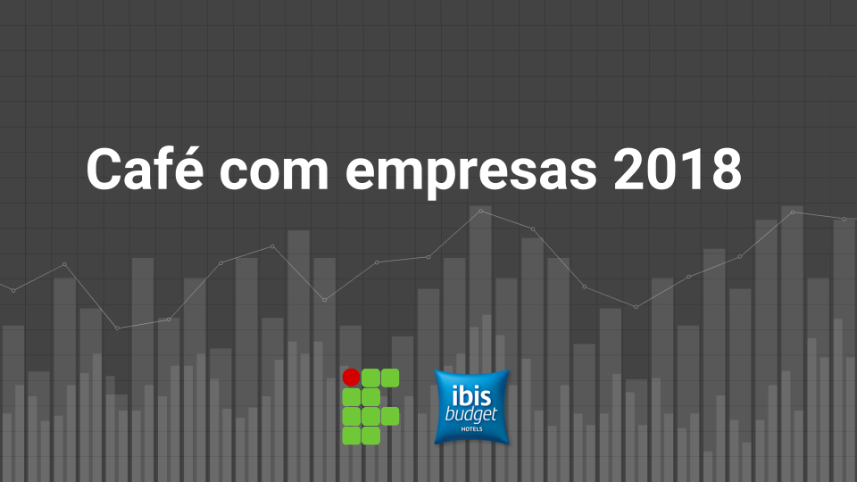
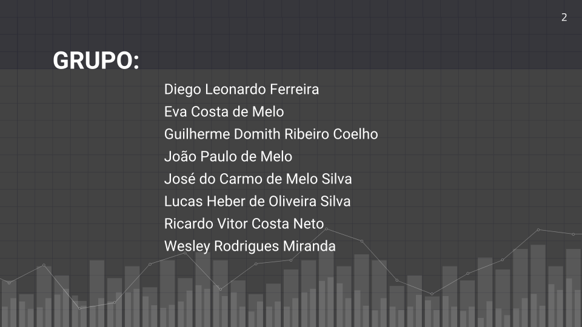
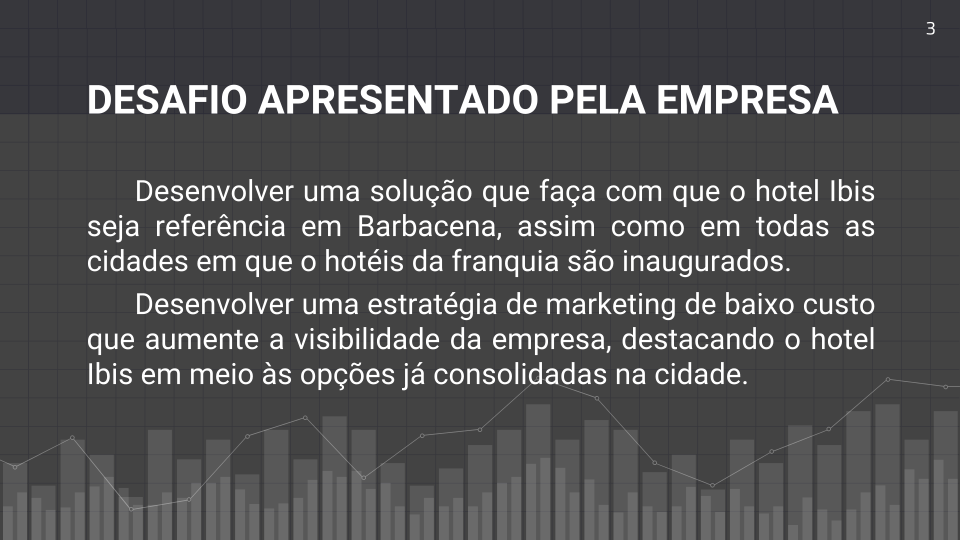
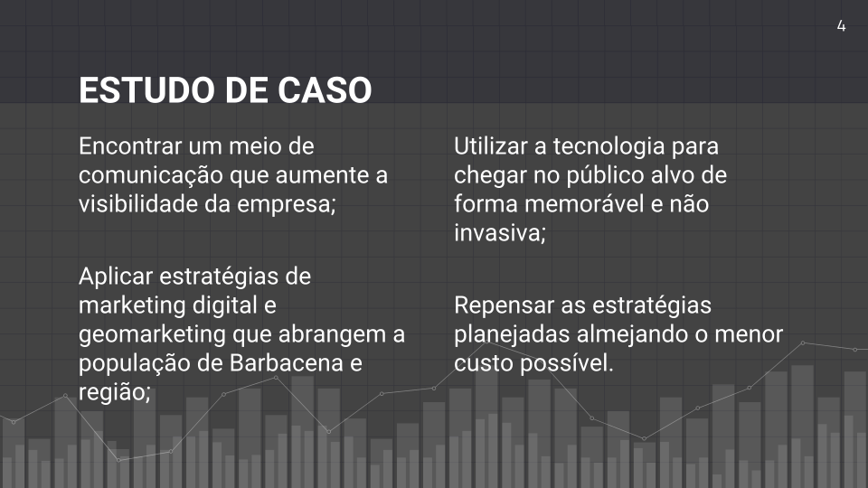
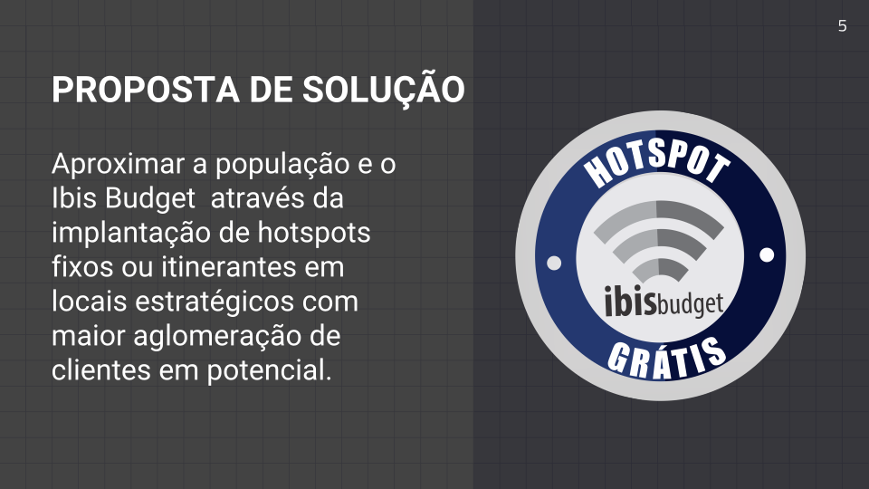

# hotspot Ibis
Ideia em 1ª colocação apresentada no II Café com empresa para a empresa Ibis.

O desafio era:

* Desenvolver uma solução que faça com que o hotel Ibis seja referência em Barbacena, assim como em todas as cidades em que o hotéis da franquia são inaugurados.

* Desenvolver uma estratégia de marketing de baixo custo que aumente a visibilidade da empresa, destacando o hotel Ibis em meio às opções já consolidadas na cidade.

## Proposta

Aproximar a população e o Ibis Budget  através da implantação de hotspots fixos ou itinerantes em locais estratégicos com maior aglomeração de clientes em potencial.

## Infográfico

  

## Slides

  

  

  

  

  

  

  

  

  

  

## Protótipo

  

  

  

